# SSAFY 1학기 최종 프로젝트
* 코드 링크 : https://lab.ssafy.com/s09/a07/ssafy9_test/-/tree/main/FinalPJT_%EC%A0%95%EC%9D%98%EC%84%9D_%EC%9D%B4%EC%A3%BC%ED%9D%AC

## 팀명 : 발빠짐 주 의
* 팀장 : 정의석
* 팀원 : 이주희                  

## 프로젝트 설명
* SSAFIT 사이트 구현
    * 운동 영상을 검색하여 찜 및 댓글을 달 수 있는 사이트를 만든다.
    * 자유게시판을 이용하여 사용자끼리 게시글 및 댓글 작성을 통해 소통 가능한 사이트를 만든다.

## 역할 분담

* 공통
    * 기능 excel 만들기
    * 목업 디자인
    * vuetify를 이용한 전체 디자인

* 의석
    * Spring 유저 등록, 삭제, 수정 구현
    * Spring 게시판 등록, 삭제, 수정 기능 구현
    * Vue 유저, 게시판, 로그인 기능 구현
    * Vue 게시판 등록, 삭제, 수정, 신고기능 구현

* 주희
    * Spring 비디오 검색, 상세보기 기능 구현
    * Spring 비디오 댓글기능 구현
    * 유튜브 API를 이용하여 비디오 정보 추출
    * Vue 비디오 상세보기, 댓글 기능 구현
    * Vue 비디오 찜 기능 구현

### Backend 주요 기능
***
| 모델 |메서드 명| 메서드 | 기능 | 경로 |
|---|---|---|---|---|
|User|selectAll|GET|유저목록|/userapi/user|
|User|select|GET|{id}로 유저 찾기|/userapi/user/{id}|
|User|insert|POST|회원가입|/userapi/user|
|User|delete|DELETE|{id}에 해당하는 회원탈퇴|/userapi/user/{id}|
|User|update|PUT|회원정보수정|/userapi/user|
|User|like|POST|{videoId}에 해당하는 영상 찜하기|/userapi/like/{videoId}|
|User|unlike|DELETE|{videoId}에 해당하는 영상 찜해제|/userapi/like/{videoId}|
|User|getLikeList|GET|영상 찜목록 반환|/userapi/like|
|Board|getUserBoard|GET|{writer}가 작성한 게시물 목록|/userapi/user/board/{writer}|
|Board|getBoardList|GET|게시물 목록|/boardapi/board|
|Board|writeBoard|POST|게시물 작성|/boardapi/board|
|Board|getBoard|GET|{id}에 해당하는 게시물 상세 페이지|/boardapi/board/{id}|
|Board|modifyBoard|PUT|게시물 수정|/boardapi/board|
|Board|removeBoard|DELETE|{id}에 해당하는 게시물 삭제|/boardapi/board/{id}|
|BoarComment|getBoardComments|GET|게시물별 댓글 목록|/boardcommentapi/boardcomment|
|BoarComment|getBoardComment|GET|{id}에 해당하는 댓글 선택 반환|/boardcommentapi/boardcommet/{id}|
|BoarComment|writeBoardComment|POST|{boardId}에 해당하는 게시글에 댓글 작성|/boardcommentapi/board/{boardId}|
|BoarComment|modifyBoardComment|PUT|{boardId}에 게시글에 있는 {id}에 해당하는 댓글 수정|/boardcommentapi/board/{boardId}/{id}|
|BoarComment|removeBoardComment|DELETE|{boardId}에 게시글에 있는 {id}에 해당하는 댓글 삭제|/boardcommentapi/board/{boardId}/{id}|
|VideoComment|getList|GET|영상별 댓글 목록|/videoapi/videocomment|
|VideoComment|write|POST|{videoId}에 해당하는 영상에 댓글 등록|/videoapi/{videoId}|
|VideoComment|modify|PUT|{videoId} 영상에 {commentSeq}에 해당하는 댓글 수정|/videoapi/{videoId}/{commentSeq}|
|VideoComment|remove|DELETE|{videoId} 영상에 {commentSeq}에 해당하는 댓글 삭제|/videoapi/{videoId}/{commentSeq}|

### Frontend 컴포넌트
***
| 탭 타이틀 | 컴포넌트 | 이름 | 경로 |
|---|---|---|---|
|SSAFIT|SsafitView|ssafit|/|
|SSAFIT Board|BoardView|board|/board|
|게시글 목록|BoardList|boardList|/board/list|
|게시글 작성|BoardCreate|boardCreate|/board/create|
|게시글 상세|BoardDetail|boardDetail|/board/{boardId}|
|게시글 수정|BoardUpdate|boardUpdate|/board/update|
|영상 검색결과|SearchView|search|/search|
|영상 상세|VideoView|video|/{videoId}|
|로그인|LoginForm|login|/login|
|...|User|...|/user|
|회원가입|UserRegist|userRegist|/user/regist|
|마이페이지|UserBoard|userBoard|/user/{userId}|
|마이페이지|UserDetail|userDetail|/user/{userId}/detail|
|작성한 게시글|UserBoardList|userBoardList|/user/{userId}/{boardwriter}|
|영상 찜목록|UserLikeList|userLikeList|/user/{userId}/video|

### 화면 설계 및 기능
***
* 공통부분
    * Header
        * 평상시 로그인(로그인 창으로 이동) / 회원가입(회원가입 창으로 이동) 버튼을 보여준다.
        * 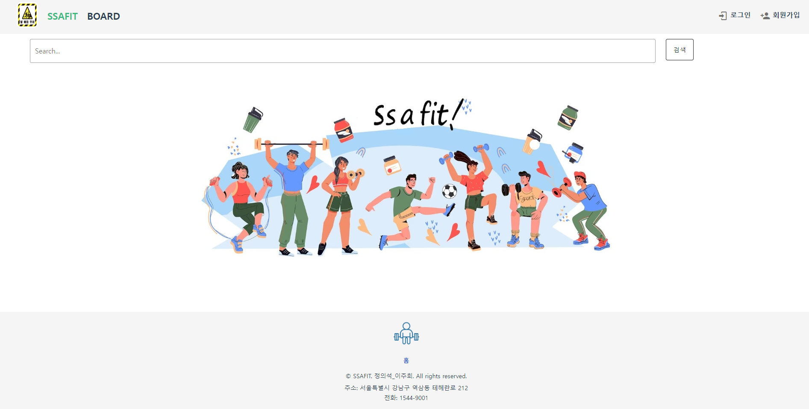
        * 사용자가 로그인을 하면 {nickname}과 로그아웃(로그아웃 기능) / 마이페이지(마이페이지로 이동) 버튼을 보여준다.
        * 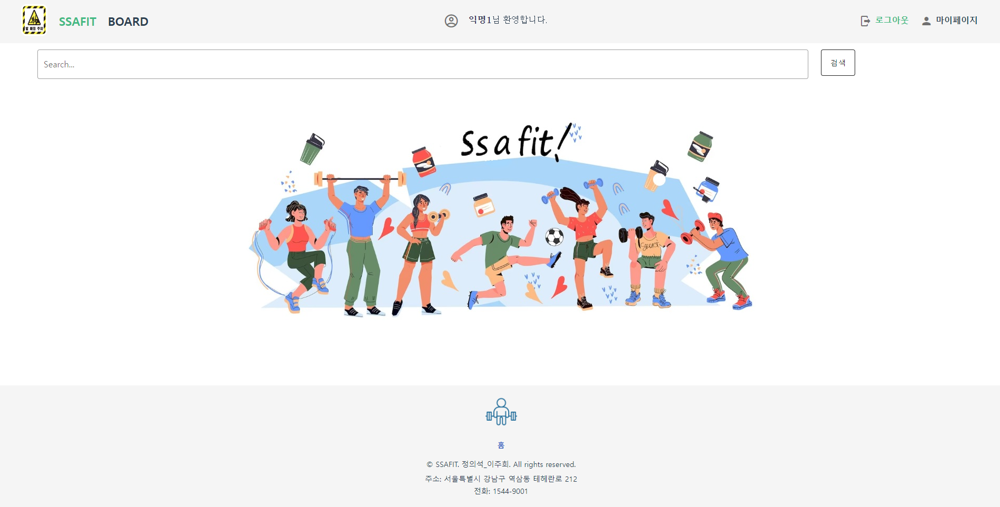
    * Footer
        * 운동 로고
        * 홈 버튼 (SSAFIT 홈으로 이동한다.)
    
* 메인페이지
    * SSAFIT : 운동영상 검색기능
        * 검색창에 내용을 입력하면 영상 목록들을 보여준다.
    * BOARD : 게시판으로 이동한다.
    * 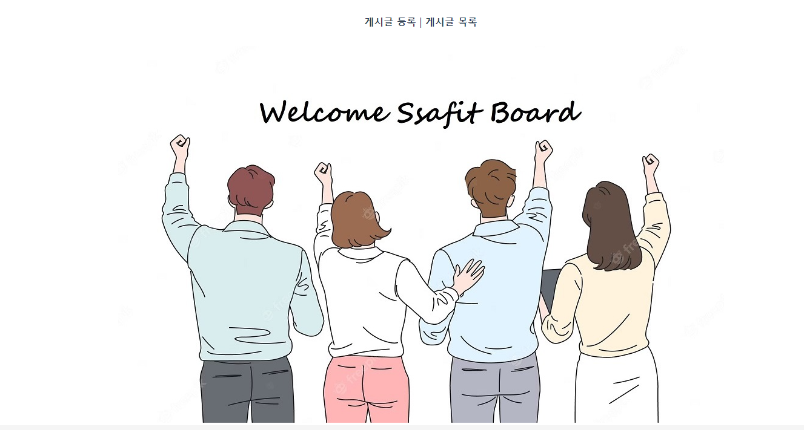

* 로그인
    * 로그인을 할 수 있는 페이지이다.
    * 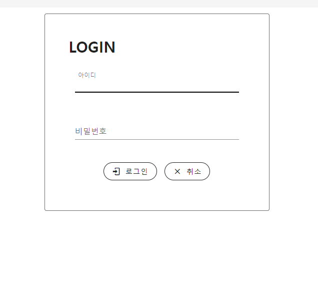
    * 해당 아이디를 가진 사용자가 존재하고 아이디와 패스워드가 일치하면 로그인에 성공한다.
    * 로그인이 성공하면 메인페이지로 이동한다.
    * 취소 버튼을 이용해 메인페이지로 다시 돌아갈 수 있다.
    * 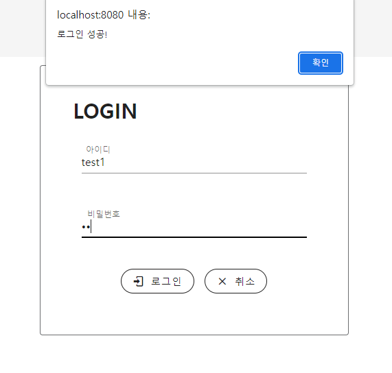

* 회원가입
    * 회원가입을 할 수 있는 페이지이다.
    * 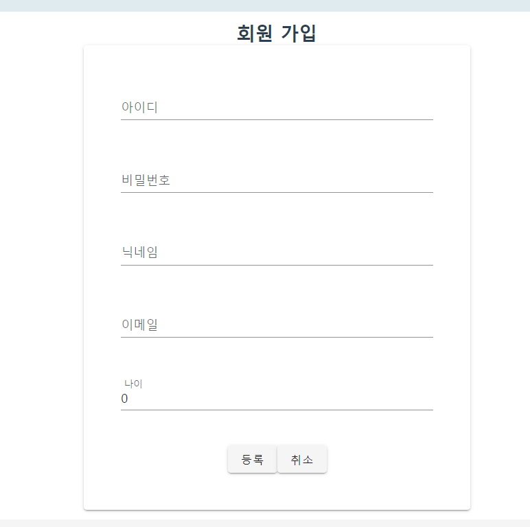
    * 아이디, 비밀번호, 닉네임, 이메일, 나이를 입력하면 회원가입에 성공한다.
    * 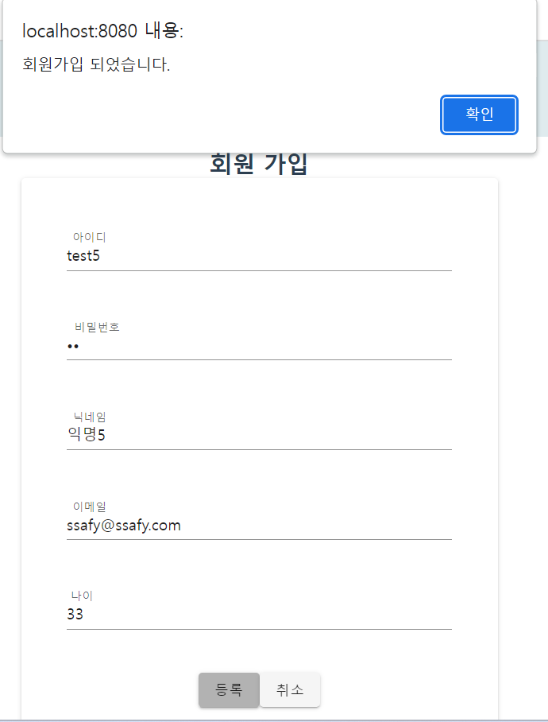
    * 만약 아이디, 닉네임, 이메일 중 하나라도 기존 사용자와 중복이 되면 중복된다는 alert창이 뜬다. -> 3개를 구분해서 alert창을 띄우는데는 실패..
    * 빈칸이 있으면 모든 내용을 입력해달라는 alert창이 뜬다.
    * 취소 버튼을 이용해 메인페이지로 다시 돌아갈 수 있다.

* 마이페이지
    * 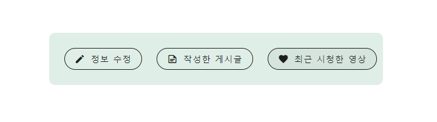
    * 정보수정
        * 회원정보 수정 페이지로 이동하기 전에 비밀번호 확인을 한다.
            * 만약 비밀번호가 일치하지 않으면 회원정보 수정 페이지로 이동할 수 없다.
        * 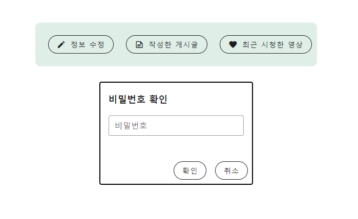
        * 회원정보 수정 페이지에서는 비밀번호 수정과 회원탈퇴가 가능하다.
        * 뒤로가기 버튼을 이용해 마이페이지로 다시 돌아갈 수 있다.
        * 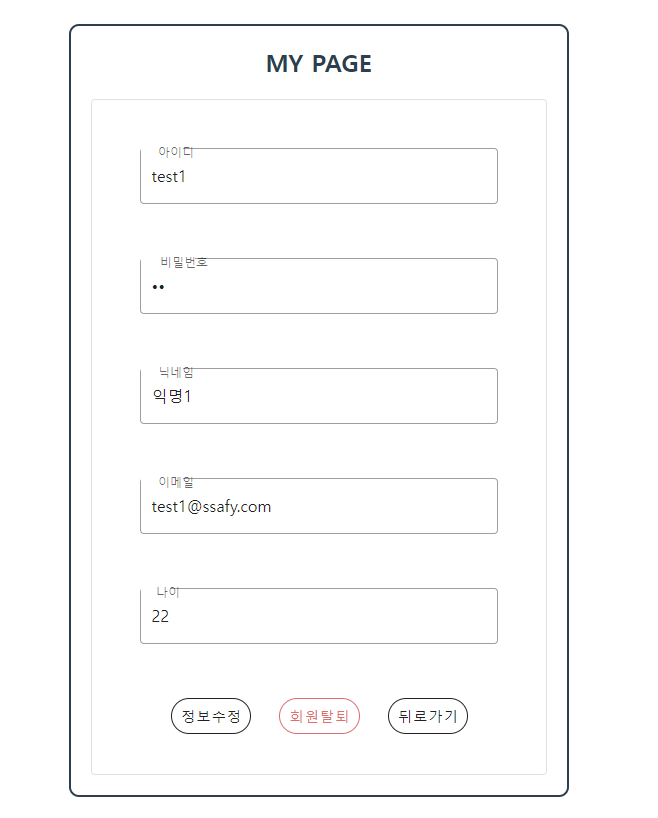
    * 작성한 게시글
        * 본인이 작성한 게시글 목록을 볼 수 있다.
        * 게시글의 제목을 누르면 해당 게시글의 상세페이지로 이동할 수 있다.
        * 제목, 닉네임, 조회수, 등록일로 정렬이 가능하다.
        * 뒤로가기 버튼을 이용해 마이페이지로 다시 돌아갈 수 있다.
        * 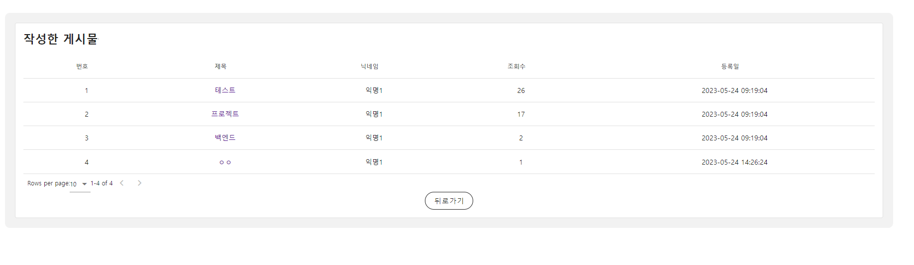
    * 찜한 영상
        * 유저가 찜한 영상 목록을 볼 수 있다. -> 찜 삭제 기능은 구현 실패..
        * 찜한 영상의 제목을 누르면 해당 영상을 볼 수 있는 페이지로 이동한다.
        * 뒤로가기 버튼을 이용해 마이페이지로 다시 돌아갈 수 있다.
        * 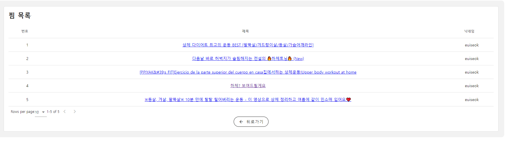

* 검색결과 화면
    * 검색 내용에 따라 영상 목록을 보여준다.
        * 해당 영상을 클릭하면 영상의 상세페이지로 넘어간다.
    * 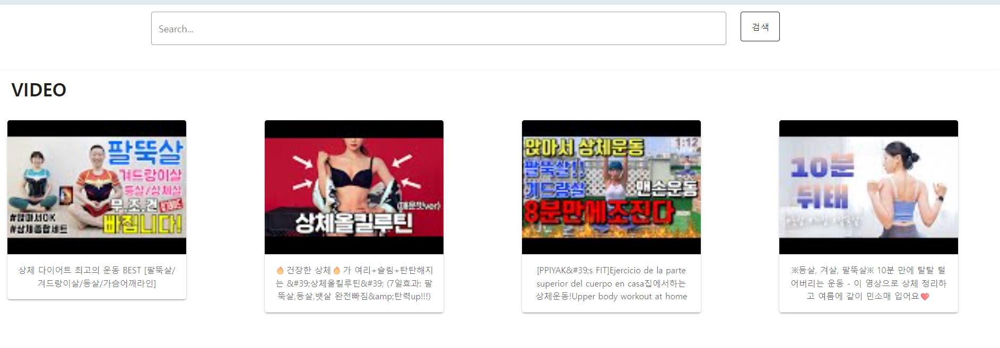

* 영상 상세페이지
    * 영상
        * 영상을 누르면 재생된다.
    * 찜버튼
        * 찜 기능을 하는 버튼 -> 구현 실패..
    * 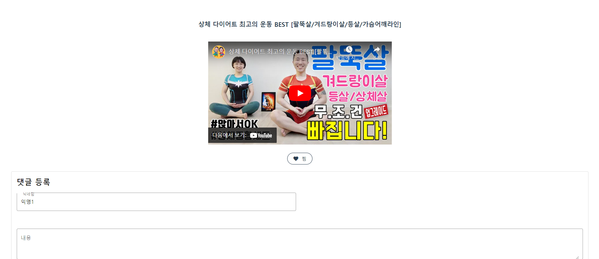
    * 댓글 등록
        * 내용을 입력하면 댓글 입력이 가능하다.
        * 내용을 입력하지 않으면 내용을 입력하라는 alert창이 뜬다.
    * 댓글 목록
        * 해당 영상에 입력된 댓글 목록이 나온다.
        * 본인 댓글에 대한 수정, 삭제가 가능하다.
        * 본인 댓글이 아니면 수정 또는 삭제를 할 수 없다는 alert창이 뜬다.
        * 글쓴이, 내용, 등록일로 정렬이 가능하다.
        * 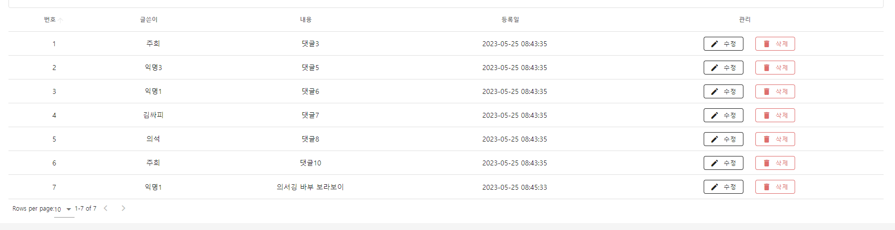

* 게시글 등록 페이지
    * 게시글 등록이 가능하다.
    * 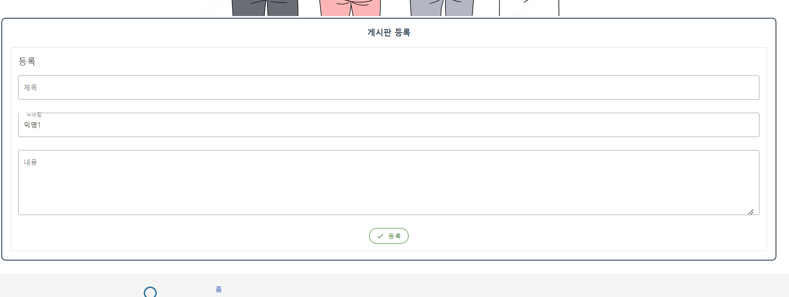
    * 제목 또는 내용이 입력되지 않으면 모든 내용을 입력하라는 alert창이 뜬다.
    * 게시글 등록이 완료되면 게시글 목록 페이지로 이동한다.
    * 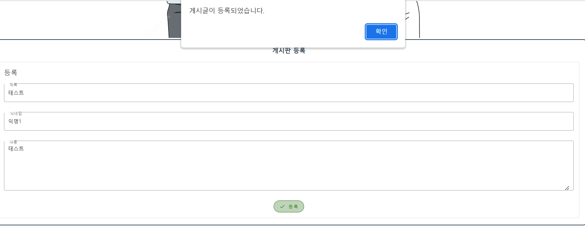

* 게시글 목록 페이지
    * 등록된 모든 게시글 목록을 보여준다.
    * 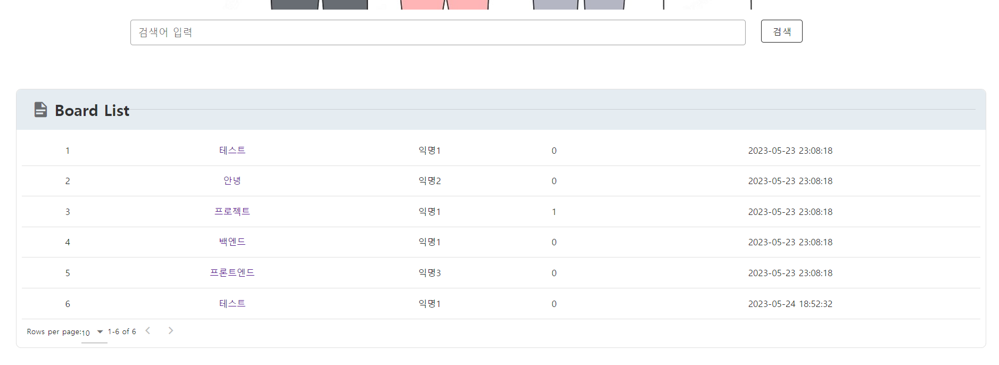
    * 제목을 클릭하면 게시글 상세 페이지로 이동한다.
    * 제목, 닉네임, 조회수, 등록일로 정렬이 가능하다.
    * 제목을 이용한 게시글 검색이 가능하다.
    * 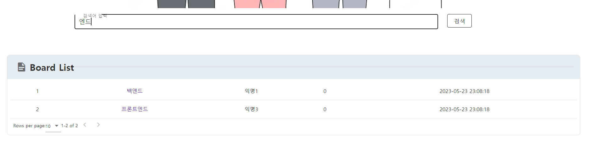

* 게시글 상세 페이지
    * 해당 게시글의 제목, 조회수, 작성자, 작성일, 내용을 볼 수 있는 페이지이다.
    * 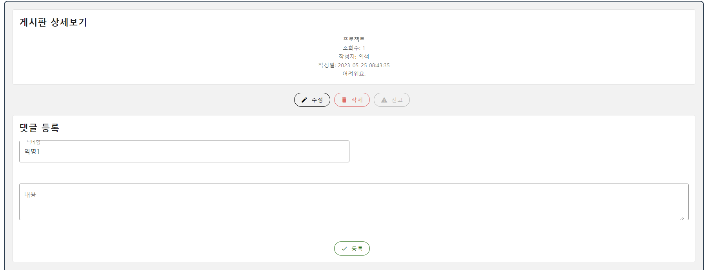
    * 본인 게시글이면 수정, 삭제가 가능하지만 신고는 할 수 없다.
    * 본인 게시글이 아니면 수정 또는 삭제를 할 수 없지만 신고는 할 수 있다.
    * 신고가 3회 누적되면 해당 게시글은 자동으로 삭제된다.
    * 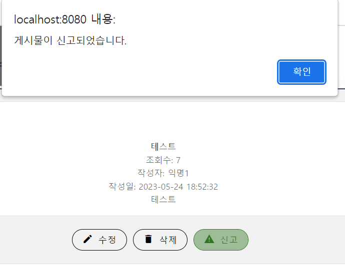
    * 같은 사용자가 같은 게시글을 신고할 수 없다.
    * 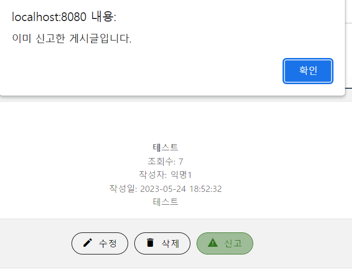
    * 댓글 등록
        * 내용을 입력하면 댓글 등록이 가능하다.
        * 내용을 입력하지 않으면 내용을 입력하라는 alert창이 뜬다.
    * 댓글 목록
        * 해당 게시글의 댓글 목록을 보여준다.
        * 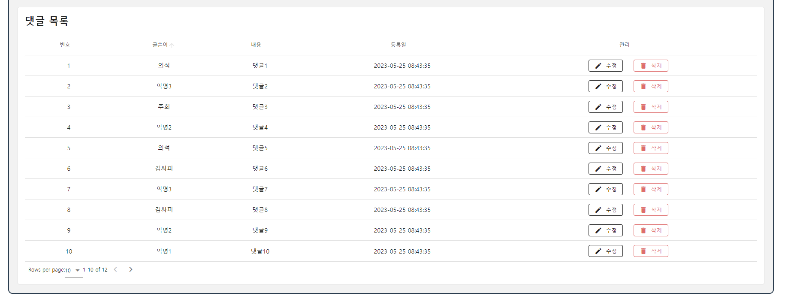
        * 글쓴이, 내용, 등록일로 정렬이 가능하다.
        * 본인 댓글이면 수정 및 삭제가 가능하다.
        * 본인 댓글이 아니면 수정 및 삭제가 불가능하다.
        * 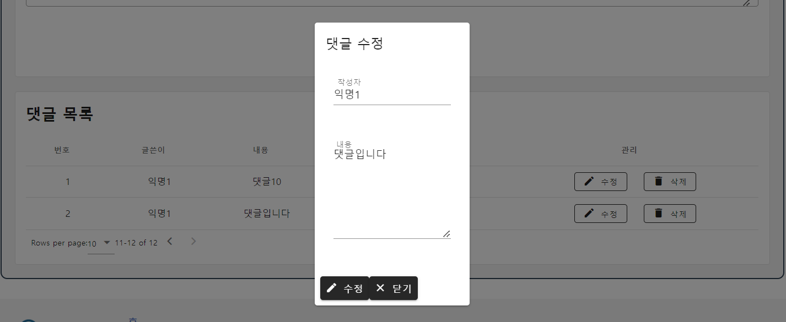

## 작업 일지

### 5월 16일 
1. 기능 excel 만들기
2. 웹페이지 설계
3. DB 설계
4. 목업 디자인

### 5월 17일
1. DB작성(비디오, 유저, 게시판)
2. Spring 구현 시작 
3. ReadMe 작성

### 5월 18일
1. Spring 구현 (비디오, 유저, 비디오댓글)
2. Vue 구현(유저)
3. 유튜브 API를 이용한 검색 기능 구현
4. ReadMe 작성

### 5월 19일
1. Spring 구현 (게시판, 유저, 비디오 댓글)
2. DB 구현(비디오댓글)
3. Vue 구현 (게시판, 비디오 댓글)
4. ReadMe 작성

### 5월 20~21일
1. Spring 구현 (본인 게시글 관리, 게시글 댓글 작성, 수정 삭제)
2. Vue 구현 (게시글 신고기능, 게시글 댓글 작성)
3. DB 구현 (게시글 댓글, 비디오)
4. ReadMe 작성

### 5월 22일 
1. Spring 구현 (비디오 댓글 관리, 게시글 댓글 관리)
2. Vue 구현(비디오 댓글 등록, 비디오별 댓글 조회, 수정, 삭제 & 게시글 댓글 등록, 게시글별 댓글 조회, 수정, 삭제)
3. ReadMe 작성

### 5월 23일 
1. Spring 구현 (비디오 찜목록, 찜등록, 삭제 구현)
2. Vue 구현 (비디오 댓글, 게시물 댓글 세부 기능 구현 (경고창 띄우기, 빈칸이면 다시 입력하도록 하기 등))
3. DB 구현 (비디오 찜 관리하는 테이블 생성)
4. ReadMe 작성

### 5월 24일 
1. Vue (Vuetify를 이용한 전체 디자인)
2. Vue (댓글 세부 기능 수정)
3. Spring (사용자 정보 수정 기능 수정)
4. Vue (사용자 정보 수정 기능 수정)
5. Vue (웹페이지 탭 이름 설정)
6. DB 정리 (넣어줄 데이터 정리)
7. ReadMe 작성

### 5월 25일
1. Vue (Vuetify를 이용한 전체 디자인)
2. Vue (비디오 댓글 관리 기능 수정)
3. Vue (비밀번호 확인 기능 구현)
4. Vue (영상 찜 기능 구현)
5. ReadMe 작성
6. ppt 작성
